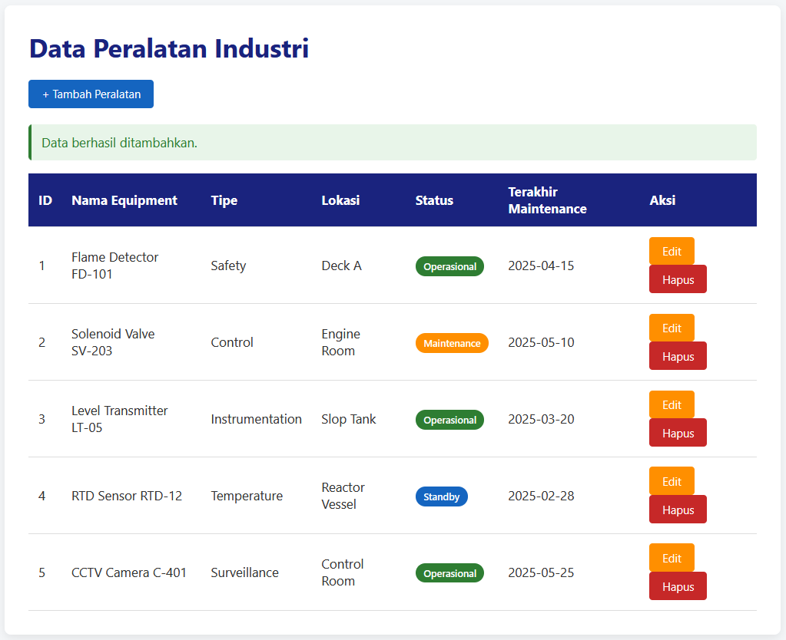
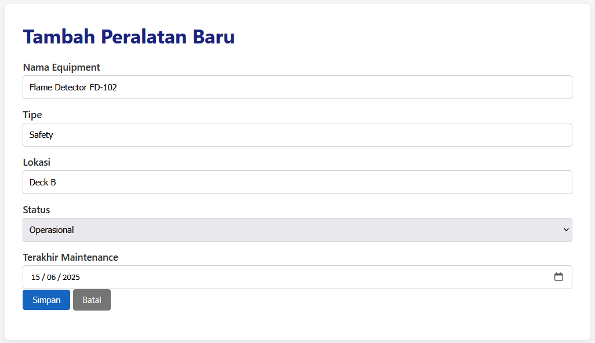
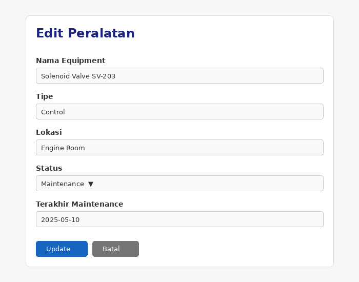
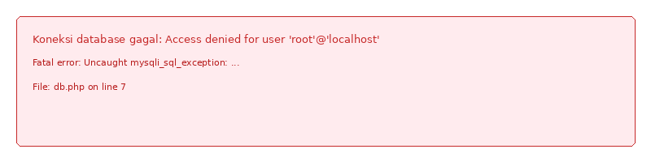

# Mini Aplikasi CRUD - Manajemen Peralatan Industri

Aplikasi web sederhana untuk operasi CRUD (Create, Read, Update, Delete)
menggunakan PHP dengan MySQLi **procedural** dan prepared statement.

## File

- db.php           → Koneksi database (MySQLi procedural)
- index.php        → Tampil data & hapus (Read, Delete)
- create.php       → Form tambah data (Create, prepared statement)
- edit.php         → Form edit data (Update, prepared statement)
- style.css        → Tampilan UI
- database.sql     → Struktur database + data contoh

## Cara Menjalankan

1. Copy semua file ke folder `htdocs/RTZ-Aplikasi-Mini-CRUD` (XAMPP) atau folder web root lain.
2. Import `database.sql` melalui phpMyAdmin.
3. Sesuaikan konfigurasi koneksi di `db.php` jika user/password MySQL Anda berbeda.
4. Buka browser dan akses: `http://localhost/RTZ-Aplikasi-Mini-CRUD/index.php`.

## Screenshot Hasil Program

Berikut adalah tampilan aplikasi saat dijalankan di localhost:

### 1. Halaman Index - Daftar Peralatan (Read)

### 2. Halaman Tambah Data (Create)

### 3. Halaman Edit Data (Update)

### 4. Pesan Error Handling

